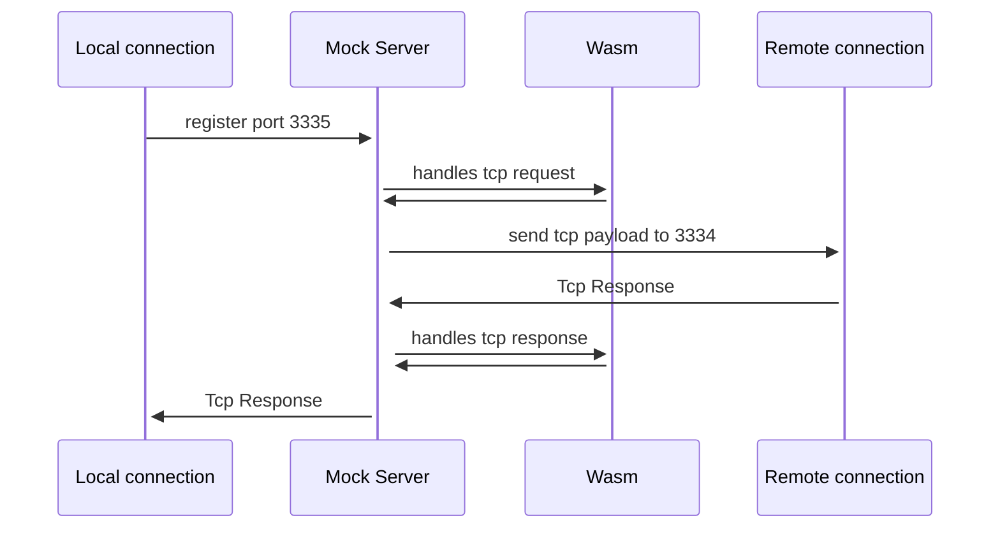

A collection of crates for Automation and Mocking in Wasm Mock Server
===========================

<!--  -->
<br />

Wasm Mock Util is a collection of macros and functions that are built on top of WAPC protocol used in Wasm Mock Server. Wasm Mock Server accepts user's defined webassembly for mocking and automation via post request.

Cargo.toml
```toml
[dependencies]
wapc-guest = {git = "https://github.com/wasmmock/wapc-rs"}
wasm-mock-util = {path = "crates/wasm-mock-util"}
wasm-mock-websocket = {path = "crates/wasm-mock-websocket"}
websocket-codec = {path = "crates/websocket-codec"}
rmp-serde = "0.15.5"
lazy_static = "1.4.0"

[[example]]
name = "fiddler_ws"
path = "examples/ws_tcp_fiddler/ws.rs"
```

```bash
Operation=set_mock_fiddler
Port=20825
Mock=/hello,\/v2\/seasons\/.*\/competitions
curl -X POST "http://$MockServer:$Port/call/$Operation?targets=$Mock" \
	--header "Content-Type:application/octet-stream" \
	--data-binary "@target/wasm32-unknown-unknown/release/examples/$wasm_file.wasm"
```

## To Test Tcp Mock Fiddler
Start wasm_mock_server

Requirement (only for running cli.sh)
* cargo install wasm-gc
* brew install xmlstarlet

(in golang_ws_server)
* go mod tidy
* go run main.go

(in wasm_mock_rust)
* bash cli/mock_ws.sh

(in browser)
* Go to localhost:3334
* Click Connnect --> You should see Open
* Send some message --> You should see response text "echo" even if the golang websocket server supposed to echo all messages.



## Mocking
Url Parameter: targets
| Operation  | Explaination | Targets (comma separated) | Targets Example | 
| ------------- | ------------- | ------------- | ------------- |
| set_mock_fiddler  | Mock Http Proxy by path  | paths | /hello,\/v2\/seasons\/.*\/competitions |
| set_mock_tcp_fiddler  | Mock TCP Proxy by local connection and remote connection | {local port}-:{remote port}  | 3335-:3334 |

## Recording fiddler request and response
Url Parameter: targets, duration(in sec)
Returns report id
| Operation  | Explaination | Targets (comma separated) | Targets Example |
| ------------- | ------------- | ------------- | ------------- |
| fiddler  | Record HTTP fiddler in a report for a duration | paths | /hello,\/v2\/seasons\/.*\/competitions |
| tcp_fiddler  | Record Tcp fiddler in a report for a duration | {local port}-:{remote port}  | 3335-:3334 |

## Automation
Url Parameter: targets, loop
Returns report id
| Operation  | Explaination |
| ------------- | ------------- |
| http  | For HTTP Automation | 
| rpc  | For RPC Automation only used with customization of wasm mock server |

## Report
Report id 
html -> http://$MockServer:$Port/report/${report id}
json -> http://$MockServer:$Port/report_data/${report id}.json


